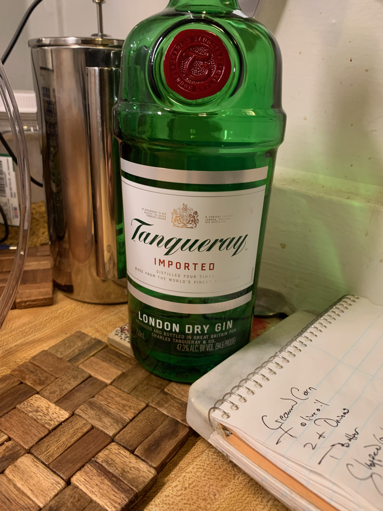

## Raleigh's Heartbreak Buttermilk Pie ##

_By David Blount_

**Prep Time:** tbd
**Cook Time:** tbd
**Total Time:** tbd

### Buttermilk Pie Filling Ingredients ###

- 1/2 Cup Butter
- 1/2 Cup Sugar
- 3 Tbsp All Purpose Flour
- 3 Eggs
- 1 Cup Buttermilk
- 1 Tbsp Vanilla Extract

#### Buttermilk Pie Crust Ingredients

- 1 Cup Flour
- 1/2 Cup Cornmeal
- 3 Tbsp Sugar
- 1/2 Salt
- 1 Stick Butter
- 1 Egg Yolk
- 2 Tbsp Ice Water

### Buttermilk Pie Recipe ###

Bake your pastry lined with foil for 10 minutes in a 450 degree oven. Remove the foil and bake for an additional 4 minutes or until golden brown. Reduce oven temperature to 350 degrees.

> **CHEF'S NOTE** At this point pour yourself a (Dave's Favorite Gin Drink - Recipe to Follow)

  
Melt your butter over medium heat in a saucepan and then stir in sugar and flour. **IMPORTANT:** It is very crucial to incorporate them together like this. Remove from heat and let sit while you beat the eggs with an electric mixer on medium speed until fluffy (preferably 1 minute or more). Stir this into the buttermilk / vanilla mixture. Whisk in the Butter, Sugar, Flour mixture and pour into your prepared crust.

Bake this for around 50 minutes or until the center is set when shaken gently.

> **CHEF'S NOTE** Cool for at least 1 hour before serving, but is best refrigerated. Enjoy!

### Buttermilk Pie Crust Nutritional Information (per serving) ###

| Ingredient | Calories |
| :------------: | :------------: |
| x Cup Butter     | TBD     |
| x Cup Sugar    | TBD     |
| x Tbsp All Purpose Flour     | TBD     |
| x Eggs   | TBD     |
| x Cup Buttermilk   | TBD    |
| x Tbsp Vanilla Extract   | TBD  |
| **Calorie Total**  | **TBD**     |

### Buttermilk Pie Filling Nutritional Information (per serving) ###

| Ingredient | Calories |
| :------------: | :------------: |
| x Cup Flour     | TBD     |
| x Cup Cornmeal    | TBD     |
| x Tbsp Sugar     | TBD     |
| x Salt   | TBD     |
| x Stick Butter  | TBD    |
| x Egg Yolk   | TBD  |
| x Tbsp Ice Water  | TBD  |
| **Calorie Total**  | **TBD**     |

