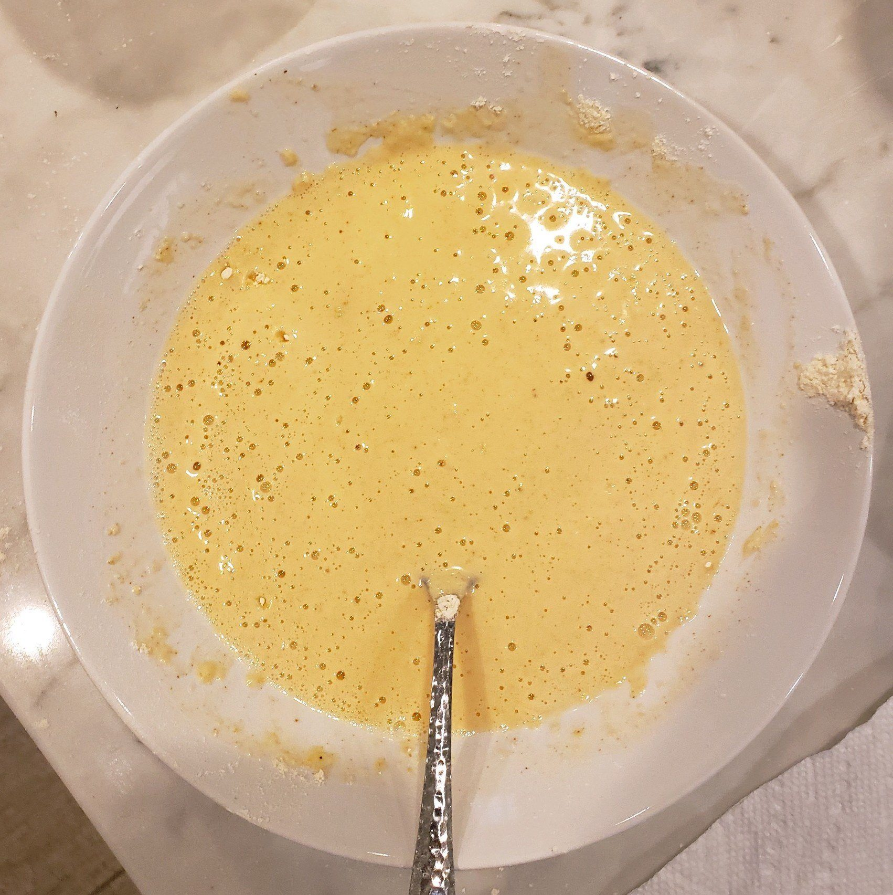
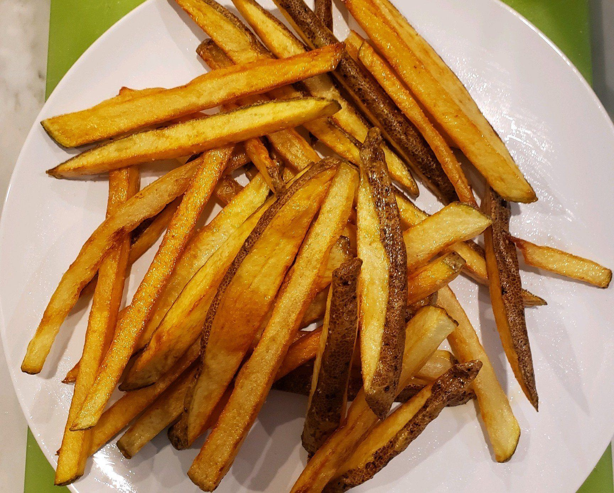

## John's Fish & Chips ##

_By John VanHevel_

**Prep Time:** 10 Minutes
**Cook Time:** 20 Minutes
**Total Time:** 30 Minutes

### Fish & Chips Ingredients ###

- 3 or 4 Large Rustic Potatoes
- 1 & 1/2 lb Cod Filets
- 1 qt Vegetable Oil (or until 2 inches deep in pan)
- Malt Vinegar
- Salt & Pepper (to taste)
- Drake's Crispy Frymix (for best results)

> **CHEF'S NOTE:** Follow package instructions or see batter from scratch recipe below:

### Batter from Scratch Ingredients ###

- 1 Cup Flour
- 1 Cup Fine Cornmeal
- Salt & Pepper (to taste)
- Paprika
- Milk, Water **OR** Beer

> **CHEF'S NOTE:** Use equal parts flour and cornmeal if more batter is needed. Add Milk, Water OR Beer (lager) until it has the same consistency as pancake batter.  The thinner the mix, the crispier the crust (please do NOT use both Milk and Beer).

  
### Fish & Chips Cooking Instructions ###

In a wok or large pan, bring the vegetable oil up to 400 degrees, if you do not have a way of measuring temperature, try adding a small dollop of batter to the oil, if it sizzles upon entry, you'll know the oil is hot enough.

Start by frying the chips. Wash the potatoes, chop into quarters and slice the potatoes length wise to the desired thickness (you may also choose to peel the potatoes if preferred). Add the potato wedges to the oil, and let them fry for 5 to 10 minutes or until golden brown (frying time will vary depending on thickness). Once the chips are golden brown, carefully remove from oil, and let rest on a paper towel.

> **CHEF'S NOTE:** While still hot, coat the chips in malt vinegar and season with salt and pepper to taste.

  
While the potatoes are cooking, wash the cod filets and cut them into 4 inch sections. Next, place the sections into a bowl containing the batter mixture. Remove the chips and add the batter coated cod filets into the oil. Let cook for 5 to 10 minutes or until golden brown. Serve hot with chips, malt vinegar or tartar sauce.

  
> **CHEF'S NOTE:** Garnish with cucumbers and organge peppers for a flare of color. Enjoy!

### Nutritional Information ###

(Nutritional information here)

