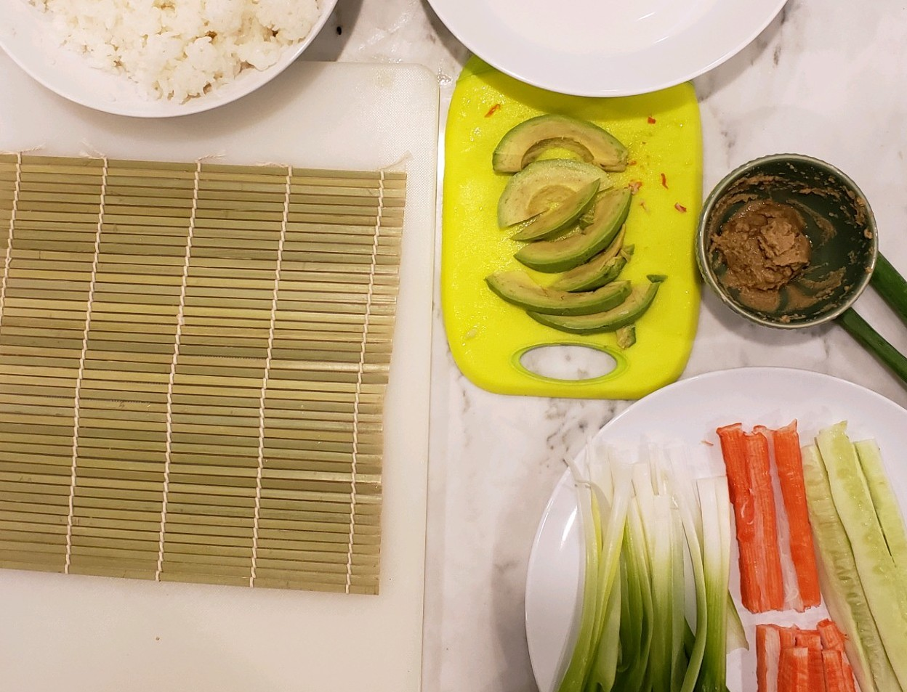
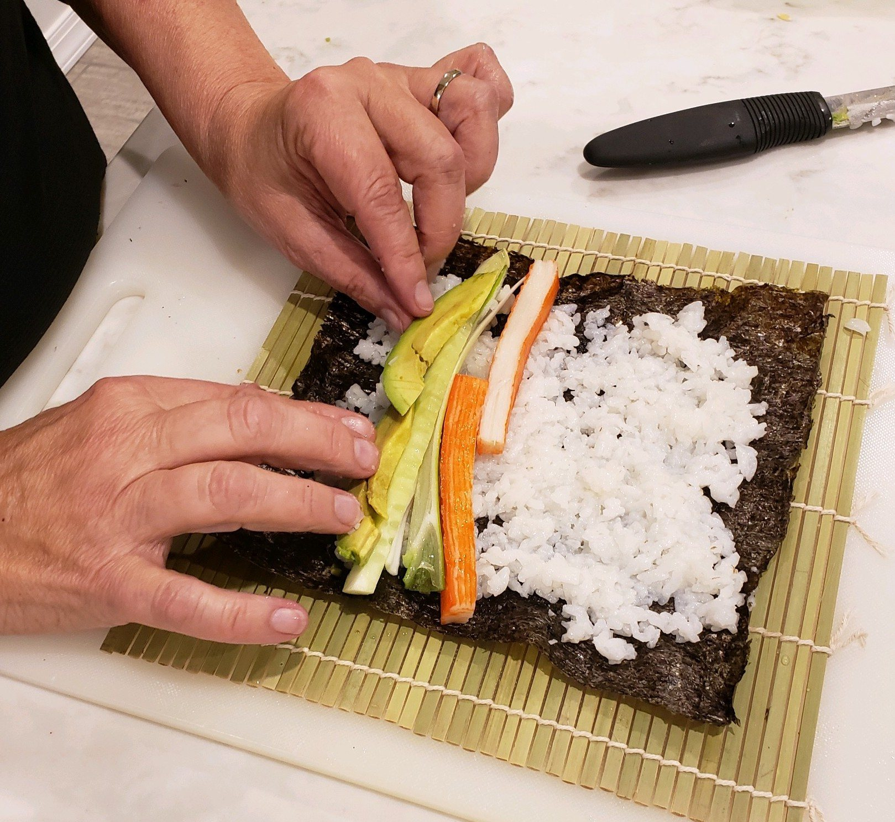

> **A california roll recipe.** Recipe top of page for the best experience. No advertisements. No long scroll. No personal history, guaranteed.

## Simple California Sushi Rolls ##

*Recipe by [John Vanhevel](https://suspicious-panini-84e3b3.netlify.app/author/john-van-hevel/),*
*Interviewed & Written by Paul VanHevel*

**Prep Time:** 40 Minutes
**Cook Time:** 20 Minutes
**Total Time:** 60 Minutes

### California Roll Ingredients ###

- 1 Cup Sushi Rice
- 1 3/4 Cup Water
- Rice Vinegar Dressing OR Rice Vinegar (add sugar)
- 1 Package 8 x 8 Nori (4 to 5 Sheets)
- 1 Package Immitration Crab (or real crab if you're fancy)
- 2 to 3 Ripe Avocados
- 1 Bushelle Green Onions
- 1 Large Cucumber
- Pickled Ginger (preferrably non-dyed)
- Real Wasabi Powder
- Soy Sauce
- Olive Oil and Salt

### Helpful Materials (not required) ###

- Small Rice Cooker
- Sushi Mat
- Beer and/or Rice Wine

> **CHEF'S NOTE:** Rice Vinegar can be used as a substitute for Rice Vinegar Dressing - Bring Rice Vinegar to a boil and add 1/4 cup suguar, stir until dissolved.

### Preparing the Rice ###

Start by washing the Sushi Rice in a colinader, rinsing with cold water. Once cleaned, add Sushi Rice, Salt and Olive Oil to Rice Cooker. Add water and let cook 40 minutes or until tender and slighly sticky, but NOT pasty.

> **CHEF'S NOTE:** Olive oil will prevent the rice from becoming overly sticky. Add 1 3/4 Cups of Water for each cup of Sushi Rice used in this recipe. Additional Salt and/or Olive Oil may be added at any time.

### Preparing the Sushi Rolls & Wasabi Mixture ###

While the rice is cooking, peel and rinse the Cucumbers and slice into modestly thick strips (lengthwise). Set aside. Next, halve the Green Onions down the middle lengthwise so that you are left with long strands. In a similar fashion, halve the crab lengthwise. Lastly and once again halve the Avocados, remove pits, score the Avocados with a knife and remove in thin wedges or slices.

  
> **CHEF'S NOTE:** Halved Avocado Skins can be used for makeshift bowls for the Soy Sauce and Wasabi Mixture.

To make the Wasabi Mixture - Add 1 Tbsp Real Wasabi Powder (or 2 if you like a kick) and a small amount of water and make into a thick paste - Let sit aside for 10 minutes.

### Time to Roll the Sushi ###

On a clean surface, lay down the Nori sheets (one sheet per roll). Wet your hands in a warm bowl of water and grab a handful of Sushi Rice. Evenly distribute the Sushi Rice across the entire roll, leaving atleast a 1/2 border on all sides (this will help seal the roll closed).

Now it's time to layer in the strips of Crab, Cucumber, Green Onion and Avocado.

  
> **CHEF's NOTE:** While keeping hands wet, "roll it up like rolling a joint" placing the seamside down. Use a Sushi Mat to firm up the Sushi and proceed to cut into 1 or 1 1/2 inch pieces. Once cut, serve with Pickled Ginger, Soy Sauce and Wasabi Mixture. Enjoy!

### California Roll Nutritional Information (per serving) ###

| Ingredient | Calories |
| :------------: | :------------: |
| 1/2 Cup Sushi Rice (cooked)     | 336     |
| Olive Oil & salt    | 336     |
| Rice Wine Vinegar Dressing     | 142     |
| 2 Sheets Nori   | 385     |
| 2 Strips Immitation Crab   | 100    |
| 1 Avocado   | 100  |
| 4 Strands Green Onion   | 12     |
| 1/2 Cucumber  | 12     |
| Wasabi Mixture  | 12     |
| Soy Sauce   | 12     |
| Pickeled Ginger   | 12     |
| **Calorie Total**  | **975**     |
