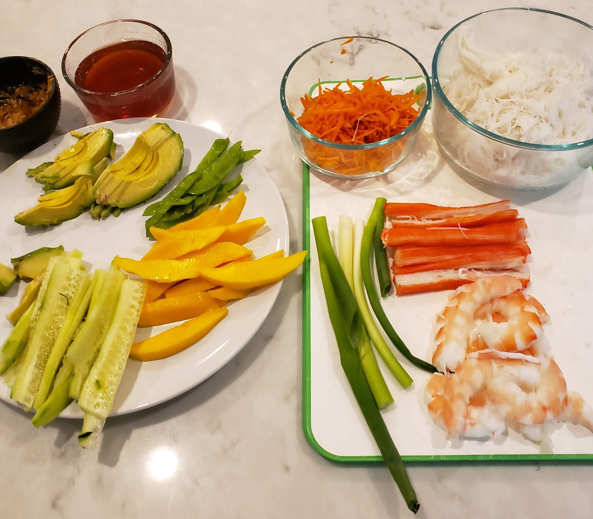

## Simple Summer Rolls Recipe (no annoying ads) ##

_By John VanHevel_

**Prep Time:** 25 Minutes
**Cook Time:** 10 Minutes
**Total Time:** 35 Minutes

### Summer Roll Ingredients ###

- 1 package rice papers
- 1 package rice noodles
- 1 or 2 whole carrots (shredded)
- 20 to 30 fresh mint leaves
- 1 bunch of green onions
- 1 cucumber (cut into 1/8 pieces lengthwise)
- 1 lb shrimp (steamed and halved)
- 1 lb imitation crab
- 1 head of lettuce

> **CHEF'S NOTE:** You can be as creative as you'd like to be substituting any of the above with asparagus, avocados, mangos, snow peas, or anything else laying around.

### Summer Roll Dipping Sauce Ingredients ###

- 1/4 cup sugar
- 1/2 cup water
- 1/2 cup red wine vinegar
- 1 to 2 tablespoon(s) fish sauce
- shredded carrots (a small pinch for color)

### Summer Roll Dipping Sauce Instructions ###

Summer rolls are meant to be served cold, for this reason, start with the dipping sauce. In a saucepan combine 1/2 cup water and 1/2 cup sugar and bring to a boil, once the sugar has been absorbed into the water (or until no longer visible), take off the burner and add 1/2 cup red wine vinegar, 1 to 2 tablespoon fish sauces, red chili peppers or cayenne pepper (to taste), and a small number of shredded carrots. Side aside and let chill in the refrigerator.

> **CHEF'S NOTE:** If something feels like it's missing, add more fish sauce, which will help enhance your flavors.

### Summer Roll Instructions ###

Start by bringing a quart of water to a boil, next peel and devein the shrimp (see Chef's Note below on how to devein a shrimp) - place raw shrimp into a metal colander or steamer basket, cover and let steam until pink. Remove from the steamer basket and let cool. Once cooled, halve the shrimp down this middle, similarly, imitation crab (or alternative ingredients) should be halved lengthwise into manageable pieces.

> **CHEF'S NOTE:** To devein the shrimp, use a knife and slice down the middle of the shrimp to reveal the dark intestine. Carefully remove with a knife or paper towel.

For the rice noodles, bring a medium pot of water to boil, add 1/3 of rice noodles to the boiling water and cover for 60 seconds. After 60 seconds, strain the water and flip the noodles onto a cutting board - Chop noodle bundle into thirds or manageable pieces, which will be used to fill your summer rolls. Set aside and let cool.

Now start prepping each ingredient for the interior of your rolls. Carefully remove the leaves from the lettuce head and set aside. Clean and peel the carrots, shred, and set aside. Next take the cucumber and slice into 8 equal (lengthwise) pieces - for example, cut the cucumber lengthwise down the middle - flip and cut in half (lengthwise) then flip and cut in half (lengthwise) once more. Repeat for the remaining half of cucumber or until you're left with manageable pieces for the roll's filling. The second cucumber should be thinly sliced into thin disks. This will be used for the lettuce wrap, which will accompany the roll in the dipping sauce.

Next remove the fresh mint leaves from their stems, and remove any excess length from the green onions (they should be roughly the same length as the roll, (finely chop and use any remaining green onion for garnish). Any additional ingredients, such as mangos, avocados, snow peaks, etc. should be cut into manageable pieces to fill each of the summer rolls. Your workstation should resemble the below:

### Assembling the Summer Rolls ###

Next, dip each of the rice papers into warm water (30 seconds) and pat them dry on a dry plate or cutting board. If not dried properly, your rice paper may take on the consistency of cling wrap. Once dried, set aside.

Place the following fillings within the lower third of the rice paper (leaving ample room on each side (amounts may vary depending by recipe and ingredients used):

- shrimp (2 or 3 pieces)
- fresh mint leaves (2 or 3 pieces)
- cucumber spear (1 piece)
- rice noodles (about 2 tablespoons)
- imitation grab (1 or 2 pieces)
- green onion straw (1 piece)
- mango spear (1 piece) (optional)
- avocado slice (2 pieces) (optional)

Dip your fingers in a bowl of cold water to prevent the wrap from sticking to your hands. Fold the wrap up over the filling, and then fold the left and right sides under the filling, continue rolling the wrap tight and press the seams closed. Repeat until all filling has been used.

Cut the summer roll in half at a 45-degree angle and serve with lettuce leaves and sliced cucumbers. Place 2 or 2 sliced cucumbers into each lettuce leaf and then wrap the lettuce leaf around the roll before dipping into the homemade summer roll sauce. Enjoy!

